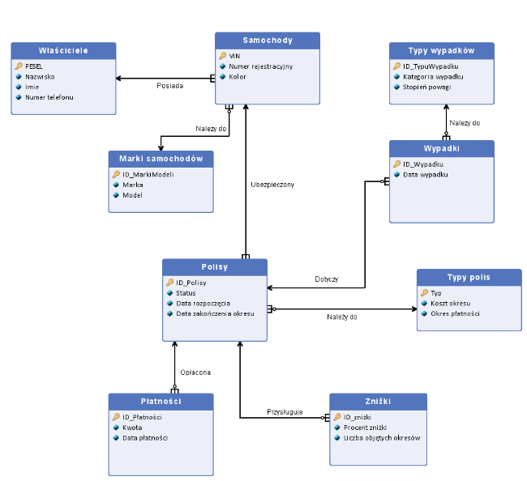

# car-insurance-sql

A relational database system designed to streamline customer service, policy management, and accident analysis for an insurance provider. 

> **Note:** This project was originally developed as part of a university course in Poland. The documentation, the database schema and sample data are in **Polish**.

## 1. Project Objectives
The primary goal is to provide an efficient tool for insurance owners and agents to:
* Manage customer and vehicle data.
* Track insurance policy lifecycles (Active, Inactive, Pending).
* Process payments and apply loyalty discounts.
* Analyze accident trends and assess customer risk levels.

## 2. System Roles & Use Cases
* **Insurance Agents:** Register new clients and process policy payments.
* **Analysts:** Evaluate accident reports to adjust risk categories and suggest policy changes.
* **Administrative Staff:** Update customer details, manage policy types, and monitor expiration dates.

## 3. Key Business Logic & Queries
The system includes predefined scripts for critical business scenarios:
* **Risk Assessment:** Identifying "high-risk" customers with multiple accidents in the last 30 days.
* **Retention & Loyalty:** Granting discounts to customers who remained accident-free for over 6 months.
* **Financial Monitoring:** Generating reports for upcoming payments and expired, unpaid policies.

## 4. Database Schema

**Glossary (PL -> EN)**

| Polish Term | English Translation |
|-------------|---------------------|
| Właściciele | Owners / Clients     |
| Samochody   | Vehicles    |
| Polisy      | Insurance Policies  |
| Wypadki     | Accidents  |
| Płatności   | Payments            |
| Zniżki      | Discounts           |
| Typy polis  | Policy Types        |
| Marki       | Car Makes / Models  |

## 5. Repository Structure
* `Docs/`
    * `Project_Report_PL.pdf`: Full project documentation in Polish.
* `SQL_Scripts/`
    * `create.sql`: Table definitions and constraints.
    * `insert.sql`: Sample data for testing.
    * `select.sql`: Advanced analytical queries and Views.
    * `cascade.sql`: Implementation of referential integrity logic.
    * `drop.sql`: Cleanup script to safely remove all database objects.
* `ERD_Diagram.png`: Visual representation of the database schema.
* `README.md`: Main project documentation and overview.
